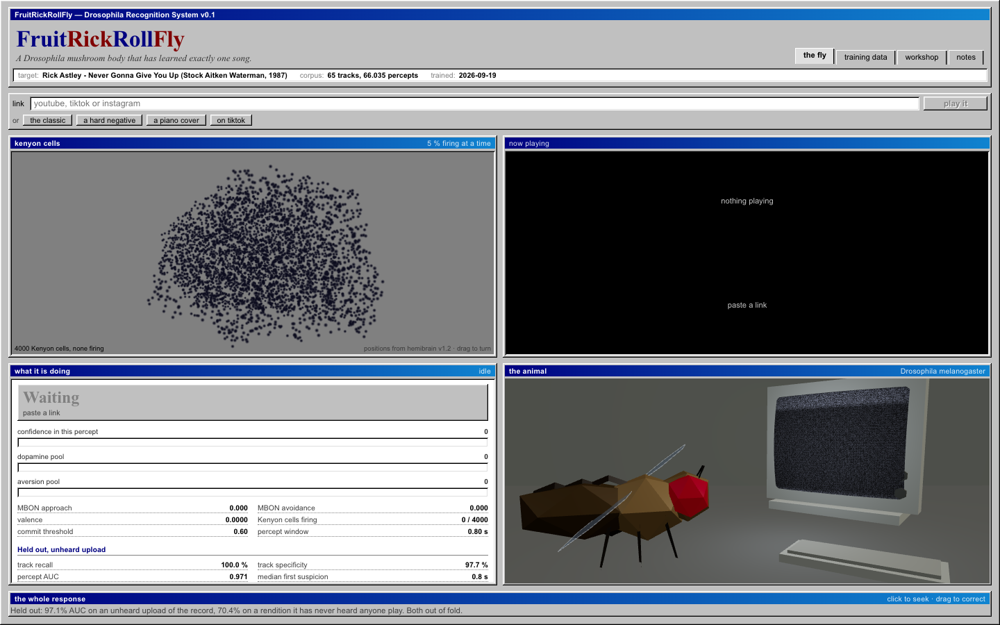
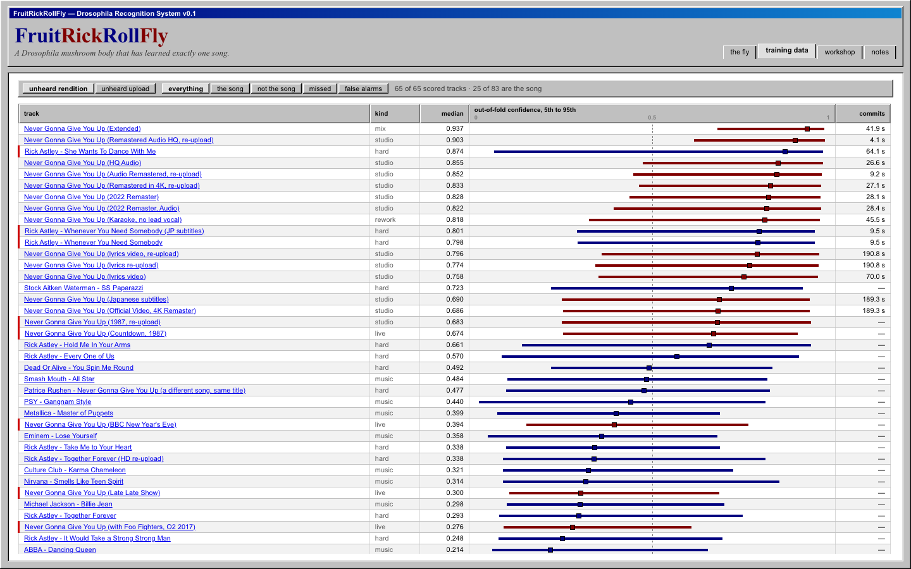
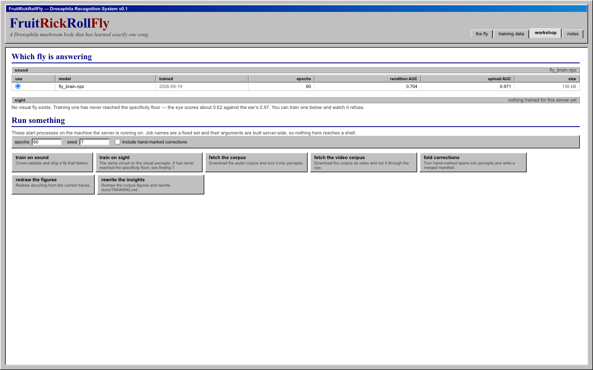

# FruitRickRollFly 🪰

> A fruit fly that has learned exactly one song.

Ein Modell des Pilzkörpers (Mushroom Body) von *Drosophila melanogaster*, das
lernt, bei einem Rickroll Dopamin auszuschütten. Link einwerfen: das Tool lädt
die Tonspur, schickt sie durch einen Nachbau des olfaktorischen Lernschaltkreises
der Fliege und zeigt Sekunde für Sekunde, was das Dopamin gemacht hat.

Ein spärlicher Zufalls-Expander, ausgelesen von zwei Ausgangsneuronen, Dopamin
als einziges Schreibsignal. Das ganze Tier wiegt 156 kB.

```
Ton ──► Johnston-Organ ──► Antennallobus ──► Kenyon-Zellen ──► MBONs ──► Dopamin-Pool ──► Urteil
        48 Mel + 12 Chroma  divisive        4.000 Zellen,     approach   leaky
        × 3 Sub-Frames      Verstärkung     200 feuern        avoidance  Integrator
        = 180 Rezeptoren                    (5 %)
```



Links die 4.000 Kenyon-Zellen an ihren echten Hemibrain-Positionen, rund 200
davon feuern gleichzeitig. Rechts das Video, das die Fliege gerade hört, und
darunter sie selbst, vor dem Monitor, in dem Raum in dem dieser Song herkommt.

## Was drin ist

| | |
|---|---|
| `brain/` | der Schaltkreis: Ohr, Verstärkungsregelung, Calyx, Ausgangskompartimente, Dopamin |
| `training/` | Korpus, Download, Kreuzvalidierung, Scoring, Plots |
| `api/` | FastAPI-App, SSE-Stream, damit der Browser live zuschauen kann |
| `web/` | React-Frontend, echte Hemibrain-Neuropile in three.js |
| `docs/BRAIN.md` | was Fliege ist und was Engineering, Zahl für Zahl |
| `docs/FINDINGS.md` | was die Messungen gesagt haben, auch das Unerfreuliche |
| `docs/ETHIK.md` | ob man das überhaupt darf. Siehe unten |

## Nutzung

```bash
uv sync --extra dev
uv pip install -e .

frrf-fetch          # Korpus laden und in Perzepte umrechnen
frrf-train          # kreuzvalidieren, Commit-Regel tunen, Fliege ausliefern
frrf-evaluate       # zeichnen, was die Kreuzvalidierung gefunden hat
frrf-insights       # Korpus zeichnen, docs/TRAINING.md schreiben
frrf-corrections    # handmarkierte Spannen zurück in den Korpus falten

cd web && npm install && npm run build && cd ..
FRRF_ADMIN=1 FRRF_DEV=1 uvicorn api.main:app
```

`FRRF_ADMIN=1` schaltet Werkstatt und Notizseite frei. Beide starten Prozesse
auf dem Rechner und schreiben Dateien, deshalb sind sie standardmäßig aus.
Details unter *Deployment*.

Das Training hält sich an eine Speicherobergrenze: 8 GB per Default,
`--memory-budget` oder `FRRF_MEMORY_BUDGET_GB` verschiebt sie. Der Lauf schätzt
seinen Peak vorher, verweigert den Start wenn es nicht passt, und meldet am Ende
den gemessenen Wert. Real sind es etwa 1,1 GB.

## Was es kann

Zwei Fragen werden gestellt, und es sind **nicht** dieselben.

**Unbekannte Darbietung.** Alle Aufnahmen einer Performance verstecken, auf dem
Rest trainieren, nach dem Versteckten fragen. Erkennt sie den Song, wenn ihn
jemand anders spielt?

**Unbekannter Upload.** Ganze Uploads des 1987er Masters zurückhalten, während
andere Uploads desselben Masters im Training bleiben. Das ist Leakage im
strengen Sinn und wird hier auch so benannt. Es ist aber exakt das, was die
Anwendung tut: der eingeworfene Link ist fast immer genau diese Platte als
Re-Encode, Remaster oder Lyric-Video.

| | Perzept-AUC | Track-Recall | Track-Spezifität | erster Verdacht | Commit |
|---|---|---|---|---|---|
| **unbekannte Darbietung** | 0,704 macro · 0,780 gepoolt | 0,619 | 0,909 | 2,3 s | 41,9 s |
| **unbekannter Upload** | 0,971 macro · 0,971 gepoolt | 1,000 | 0,977 | 0,8 s | 10,0 s |

65 Tracks, 66.035 Perzepte, davon 19.156 der Song. Konfidenzen werden über die
Folds gepoolt, Valenzen nie: jeder Fold trainiert eigene Ausgangsgewichte, eine
Valenz von 0,1 im einen hat nichts mit 0,1 im anderen zu tun.


Die Macro-Zahl verdeckt eine breite Streuung. Jeder Upload-Fold ist exzellent,
zwei Darbietungs-Folds liegen auf oder unter Zufallsniveau.


## Die Zahlen ehrlich lesen

**Die Schlagzeile ist die Upload-Zahl, und sie enthält konstruktionsbedingt
Leakage.** 0,971 ist das, was die ausgelieferte Fliege leistet, nachdem sie neun
andere Uploads desselben Masters gehört hat. Die richtige Zahl für das Produkt,
die falsche für „kennt sie den Song".

**Die Darbietungs-Zahl ist die ehrliche, und sie ist 0,704.** Bei einem
Klaviercover oder einer Live-Version rät die Fliege deutlich mehr, als einem
lieb ist.

**Die Track-Zahlen tragen einen milden Optimismus.** Die drei Zahlen der
Commit-Regel werden gegen die 65 Out-of-Fold-Tracks gewählt. Die Perzept-AUCs
sind davon unberührt.

**Mehr Cover zu fangen hat sie langsamer gemacht.** Der Darbietungs-Recall ging
mit dem dritten Commit-Pfad von 0,429 auf 0,619, die mittlere Commit-Zeit dabei
von 28,1 s auf 41,9 s. Langsamer geworden ist nichts: die schon vorher
gefangenen Cover werden zur selben Sekunde gefangen. Die neuen sind die
schweren, und die kommen spät.

**Und die Spezifität ist geschönt.** Vier gewöhnliche Uploads von *She Wants To
Dance With Me* dazuzunehmen (gleicher Künstler, gleiche Produzenten, gleiches
Jahr) drückt die erreichbare Upload-Spezifität von 0,977 auf 0,897, unter den
Boden, an den die Commit-Regel gebunden ist. Die Fliege hat teilweise *Stock
Aitken Waterman, 1987, diese Stimme* gelernt statt *diesen Song*.

Die Messungen dazu stehen in **[docs/FINDINGS.md](docs/FINDINGS.md)**, der
Korpus darunter in **[docs/TRAINING.md](docs/TRAINING.md)**. Kurzfassung: mehr
Epochen helfen nicht, eine andere Entscheidungsregel hilft nicht, mehr harte
Negative machen es schlechter, ein längeres Perzept-Fenster viel schlechter. Die
Grenze ist, dass die Repräsentation an der Oberfläche einer Aufnahme klebt statt
am Song.


Derselbe Korpus ist im Tab *training data* anklickbar: jeder Track mit seiner
Out-of-Fold-Streuung vom 5. bis 95. Perzentil, sortier- und filterbar, damit die
Frage „welche Negative hält sie für den Song" ein Klick ist statt eines
Rebuilds.



## Drei Wege zum Commit

Ein Rickroll kommt in drei Formen, also gibt es drei Wege.

1. **Der Pool.** Der normale Fall, braucht rund zehn Sekunden Song.
2. **Der Burst.** Ein Meme hat keine zehn Sekunden, es hat vier, hinten an ein
   Katzenvideo geklebt. Also: zwei Sekunden mit im Mittel 0,90 Konfidenz, aber
   nur in Aufnahmen bis 25 Sekunden. Diese Schranke hält den Pfad ehrlich.
3. **Die Serie.** Sechs Zehntelsekunden, in denen *jedes* aufeinanderfolgende
   Perzept bei 0,97 oder darüber liegt. Der einzige Pfad, dem die Länge des
   Videos egal ist, und damit der einzige, der die gewöhnlichste Form überhaupt
   fängt: vier Sekunden Platte, vergraben in elf Minuten von etwas anderem.

Den Burst stattdessen einfach zu entsperren funktioniert nicht, und die Messung
ist nicht knapp: über einen ganzen Track erreicht das beste Zwei-Sekunden-Mittel
0,972 bei *She Wants To Dance With Me* und 0,985 bei einem TED-Talk, während ein
echtes Elf-Minuten-Video mit vier Sekunden Platte auf 0,939 kommt. Ein Mittel
kann von einem einzigen Ausreißer getragen werden, und ein langes Video liefert
tausende Fenster, in denen sich einer finden lässt. Eine ungebrochene Serie kann
das nicht. Siehe Befund 6 in [docs/FINDINGS.md](docs/FINDINGS.md).

## Links

Akzeptiert werden YouTube, TikTok und Instagram, sonst nichts. Welche
Plattformen zählen, ist eine Produktentscheidung und steht in
`api/services/sources.py`: eine Quelle pro Definition, mit ihren Hosts, der Form
ihrer IDs und dem Weg zurück zu einer kanonischen URL.

Kurzlinks werden verfolgt, weil ein Rickroll sehr oft hinter einem steckt. Die
Regel nach der Weiterleitung ist aber dieselbe wie davor, und geprüft wird nach
*jedem* Sprung. Ein Link, der auf eine interne Adresse zeigt, endet dort.

**Instagram braucht Zugangsdaten, YouTube irgendwann auch.** Instagram liefert
Nicht-Eingeloggten eine leere Antwort. YouTube blockt Adressbereiche von
Rechenzentren, und jeder Hoster ist einer. Beides nimmt dieselbe Lösung:
`FRRF_COOKIES_FILE` auf eine Cookie-Datei im Netscape-Format zeigen lassen. Das
ist ein Credential, wer die Datei hat ist als dieser Account eingeloggt. Nimm
einen Account, dessen Verlust du verschmerzt.

## Korrekturen

Wenn die Fliege daneben liegt: über den Antwortstreifen ziehen, markieren wo der
Song wirklich ist, und sagen welcher Fall es war. Das landet in
`data/corrections.jsonl` als Append-only-Log, weil die Geschichte dessen, was
über ein Video gesagt wurde, selbst erhaltenswert ist.

```bash
frrf-corrections
frrf-train --manifest data/manifest-with-corrections.json
```

Jede Korrektur ist ihre eigene Fold-Gruppe, verschlüsselt auf Plattform und
Video. Zwei Spannen aus einem Video können so nie über eine Fold-Grenze
getrennt werden. Das sind die nützlichsten Labels, die dieses Projekt bekommen
kann: niemand korrigiert einen Fall, den die Fliege schon beherrscht, also ist
jedes einzelne per Definition außerhalb der Trainingsverteilung.

## Deployment

```bash
docker compose up -d --build     # nachdem im Caddyfile die Domain steht
```

Zwei Stufen: Node baut das Frontend, dann ein `python:3.13-slim` mit ffmpeg, der
trainierten Fliege und nichts aus `data/`. Caddy macht TLS davor. `data/` ist
ein Volume, `models/` kommt aus dem Image, ein Deploy liefert also eine Fliege
aus statt zu hoffen, dass auf der Platte eine liegt.

**Ein Worker, und das ist kein Default zum Ändern.** Analyse-Jobs, Trainingsläufe,
das Rate-Limit-Fenster und die Caches vor dem Modell liegen alle im Speicher
eines Prozesses. Ein zweiter Worker sieht nichts davon und beantwortet die
Hälfte der Event-Streams mit 404.

| | Default | |
|---|---|---|
| `FRRF_ADMIN` | `0` | ob Werkstatt und Notizseite überhaupt registriert werden |
| `FRRF_DEV` | `0` | `/docs` und das Schema ausliefern, Vite-Origin durch CORS lassen |
| `FRRF_MAX_VIDEO_SECONDS` | `1200` | abgelehnt vor dem Download durch yt-dlp, nochmal beim Dekodieren durch ffmpeg |
| `FRRF_MAX_CONCURRENT_ANALYSES` | `2` | gleichzeitige Analysen, der Rest wartet in `queued` |
| `FRRF_CACHE_BUDGET_GB` | `5` | `data/cache` wird darauf zusammengekehrt, ältestes zuerst |
| `FRRF_RATE_PER_MINUTE` | `10` | pro Client, auf den zwei Endpunkten die etwas kosten |
| `FRRF_COOKIES_FILE` | leer | Cookie-Datei für yt-dlp |
| `FRRF_BEHIND_PROXY` | `0` | erste Stufe von `X-Forwarded-For` glauben |
| `FRRF_TRUSTED_HOSTS` | leer | kommagetrennte `Host`-Whitelist |
| `FRRF_CORS_ORIGINS` | leer | kommagetrennt. In Produktion leer, das Frontend kommt vom selben Origin |

Unter `FRRF_ADMIN=1` kommt die Werkstatt dazu: welche Fliege gerade antwortet,
und Knöpfe für die Trainingsbefehle mit mitlaufendem Log. Die Jobnamen sind eine
feste Menge, ihre Argumente werden serverseitig aus Vorlagen gebaut, es gibt
keine Shell im Pfad.



Die Werkstatt gehört nicht mit Passwort ans offene Netz. `FRRF_ADMIN=0` lassen,
nichts veröffentlichen, und bei Bedarf durch einen SSH-Tunnel gehen:

```bash
ssh -L 8000:127.0.0.1:8000 du@host
```

yt-dlp veraltet innerhalb von Wochen nach einer YouTube-Änderung. Lieber nach
Plan neu bauen als einmal pinnen und vergessen.

## Ethik

Es sitzt keine echte Fliege in diesem Repository. Trotzdem ist die Frage, ob man
so etwas bauen sollte, nicht trivial, und sie wird in
**[docs/ETHIK.md](docs/ETHIK.md)** ausgeschrieben statt weggelächelt: ob Insekten
empfinden können (die Wissenschaft weiß es nicht), was es heißt, tausende
kurzlebige Gehirne zu erzeugen, von denen die meisten überwiegend „nein" hören,
und was es über uns sagt, ein Wesen zu bauen, dessen ganzes Gutes ein einziger
Popsong von 1987 ist.

## Entwicklung

```bash
pytest          # 216 Tests
ruff check .
cd web && npx tsc -b && npx oxlint
```

## Stack

`Python 3.13` · `NumPy` · `FastAPI` · `uvicorn` · `yt-dlp` · `ffmpeg` ·
`React 19` · `TypeScript` · `three.js` · `Vite` · `Docker` · `Caddy`

## Credits

Die Architektur ist die von *Drosophila*. Welche Parameter der Fliege gehören
und welche Engineering sind, sagt `brain/config.py` bei jedem einzelnen. Der Song
gehört Stock, Aitken und Waterman, 1987.

Die Neuropil-Oberflächen in `models/fly-brain.glb` und die daraus in der Calyx
gezogenen Kenyon-Zellpositionen in `web/public/kenyon-cells.bin` stammen aus dem
[Janelia FlyEM Hemibrain](https://www.janelia.org/project-team/flyem/hemibrain)
v1.2, genutzt unter CC BY 4.0. Das ist der einzige Teil dieses Repositories, der
jemandes Messung ist statt unserer Arithmetik.

<details>
<summary>🇬🇧 English</summary>

A model of the *Drosophila melanogaster* mushroom body that learns to release
dopamine when it hears a Rickroll. Paste a link: it pulls the audio, runs it
through a rebuild of the fly's olfactory learning circuit (a sparse random
expansion read out by two output neurons, with dopamine as the only write
signal) and shows what the dopamine did, second by second. The whole animal is
156 kB.

**Two questions get asked and they are not the same one.** *Unheard rendition*
hides every recording of one performance and asks about it: 0.704 macro AUC,
0.619 track recall. *Unheard upload* holds out whole uploads of the 1987 master
while other uploads of it stay in training: 0.971 macro AUC, 1.000 recall. The
second is leakage by construction, and it is also exactly what the app does,
because a pasted link is almost always that record as a re-encode. The headline
number is the dishonest one and the honest number is 0.704. Details and the
uncomfortable parts in [docs/FINDINGS.md](docs/FINDINGS.md), the circuit
argued number by number in [docs/BRAIN.md](docs/BRAIN.md).

Three ways to commit, because a Rickroll comes in three shapes: the dopamine
pool (~10 s), a burst (2 s averaging 0.90, only in clips up to 25 s), and an
unbroken run of 0.6 s at 0.97 or above, which is the only path that catches four
seconds of the record buried in an eleven-minute video.

Links: YouTube, TikTok and Instagram. Shorteners are followed, but the rule
after the redirect is the rule before it and every hop is checked. Instagram
needs a cookie jar (`FRRF_COOKIES_FILE`) and YouTube will too from any
datacenter address.

`uv sync --extra dev && uv pip install -e .`, then `frrf-fetch`, `frrf-train`,
`npm run build` in `web/`, and `uvicorn api.main:app`. Deployment is
`docker compose up -d --build` behind Caddy, one worker, admin surface off by
default. Settings table above.

No real fly is involved. Whether one *should* build this anyway is written out
rather than waved away, in [docs/ETHIK.md](docs/ETHIK.md).

</details>

> Eine Fruchtfliege mit genau einem Ohrwurm, 2026.
