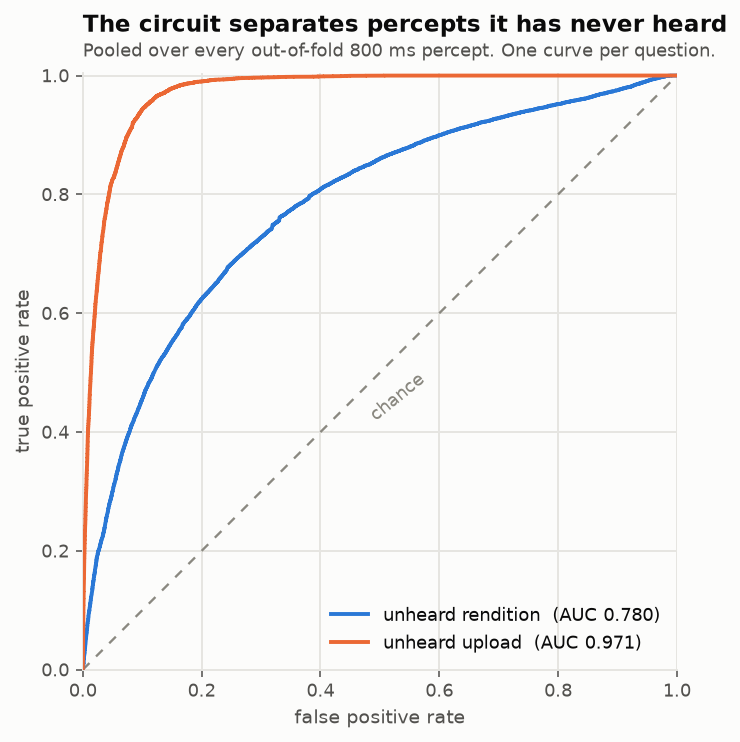
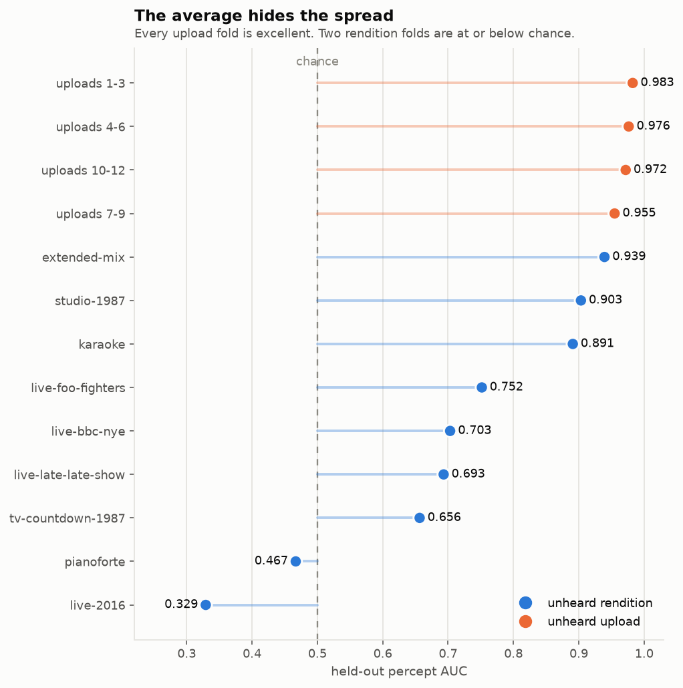
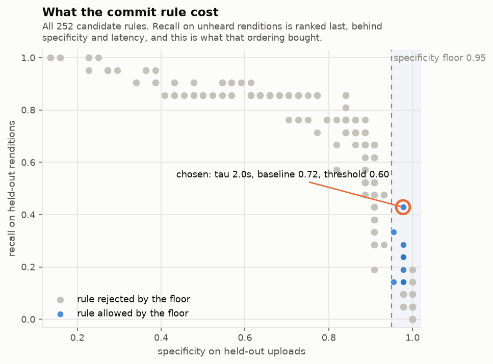

# FruitRickRollFly

A Drosophila mushroom body model that learns to release dopamine when it hears
a Rickroll.

Paste a YouTube link. It downloads the audio, runs it through a model of the
fruit fly's olfactory learning circuit — a sparse random expansion read out by
two output neurons, with dopamine as the only write signal — and shows you what
the fly's dopamine did about it, second by second.

The whole animal is 156 kB.

```
sound ──► Johnston's organ ──► antennal lobe ──► Kenyon cells ──► MBONs ──► dopamine pool ──► a verdict
          48 mel + 12 chroma   divisive gain    4,000 cells,     approach    leaky
          × 3 sub-frames       control          200 firing       avoidance   integrator
          = 180 receptors                       (5 %)
```

## Run it

```bash
uv sync --extra dev
uv pip install -e .

frrf-fetch                       # download the corpus and turn it into percepts
frrf-meshes                      # optional: rebuild the neuropil surfaces (committed already)
frrf-train                       # cross-validate, tune the commit rule, ship a fly
frrf-evaluate                    # draw what cross-validation found

cd web && npm install && npm run build && cd ..
uvicorn api.main:app             # API and frontend on one origin, one process
```

Training holds itself to a memory ceiling — 8 GB by default, `--memory-budget`
or `FRRF_MEMORY_BUDGET_GB` to move it. It projects its peak before starting,
refuses to run if that will not fit, and reports the measured peak at the end.
The real run uses about 1.1 GB.

## What it scores

Two questions get asked, and they are **not** the same question.

**Unheard rendition.** Hide every recording of one performance, train on the
rest, ask about what was hidden. Can it recognise the song when someone else
plays it?

**Unheard upload.** Hold out whole uploads of the 1987 master while other
uploads of that same master stay in training. This is leakage in the strict
sense and it is stated as such — it is also exactly what the application does,
because the link someone pastes is nearly always that record arriving as a
re-encode, a remaster or a lyric video.

| | percept AUC | track recall | track specificity | first suspicion | commits |
|---|---|---|---|---|---|
| **unheard rendition** | 0.704 macro · 0.780 pooled | 0.619 | 0.909 | 2.3 s | 41.9 s |
| **unheard upload** | 0.971 macro · 0.971 pooled | 1.000 | 0.977 | 0.8 s | 10.0 s |

There are **three** ways for the fly to commit, because a Rickroll comes in
three shapes.

The dopamine pool is the normal one and needs about ten seconds of the song.
A meme does not have ten seconds — it has four, spliced onto the end of a cat
video — so a second path commits on two seconds averaging 0.90 confidence, in
recordings of at most 25 seconds; an eight-second Rickroll commits at about
4 s. That gate is what keeps the second path honest, but it also meant the most
ordinary Rickroll of all was missed by construction: four seconds of the record
buried in eleven minutes of something else, far too long for the gate and far
too short for the pool.

So there is a third, and it is the only one that does not care how long the
video is: **six tenths of a second in which every consecutive percept is at or
above 0.97**. Ungating the second path instead does not work, and the
measurement is not close — over a whole track the best two-second mean reaches
0.972 on *She Wants To Dance With Me* and 0.985 on a TED talk, while a real
eleven-minute video carrying four seconds of the record scores 0.939. A mean
can be carried by one spike and a long video supplies thousands of windows to
find one in; an unbroken run cannot. It costs neither specificity above, and it
is why rendition recall is 0.619 rather than 0.429. See finding 6 in
[docs/FINDINGS.md](docs/FINDINGS.md).

65 tracks, 66,035 percepts, 19,156 of them the song. Confidences are pooled
across folds, never valences: each fold trains its own output weights, so a
valence of 0.1 in one fold has no relation to a valence of 0.1 in another.



The macro figure hides a wide spread. Every upload fold is excellent; two
rendition folds are at or below chance.



## Read the numbers honestly

**The headline is the upload number, and it contains leakage by construction.**
0.971 is what the deployed fly does when it has heard nine other uploads of the
same master. It is the right number for the product and the wrong number for
"does it know the song".

**The rendition number is the honest one, and it is 0.704.** For a piano cover
or a live performance the fly is much closer to guessing.

**Track-level figures carry a mild optimism.** The commit rule's numbers are
chosen against the 65 out-of-fold tracks. The percept AUCs are untouched by
that.

**Catching more covers made the fly slower to say so.** Rendition recall went
from 0.429 to 0.619 when the third path was added, and the median commit time
went from 28.1 s to 41.9 s with it. Nothing got slower: the covers that were
already caught are caught at the same moment as before. The ones that are new
are the hard ones, and they are caught late.

**And the specificity is flattered.** Adding four ordinary uploads of "She
Wants To Dance With Me" — same artist, same producers, same year — drops the
best reachable upload specificity from 0.977 to 0.897, below the floor the
commit rule is held to. The fly has partly learned *Stock Aitken Waterman,
1987, that voice* rather than *this song*.

That measurement, and the four others around it, are written up in
**[docs/FINDINGS.md](docs/FINDINGS.md)**. The short version: more epochs will
not help, a different decision rule will not help, more hard negatives make it
worse, a longer percept window makes it much worse, and the constraint is that
the representation is anchored to the surface of one recording rather than to
the song.



## Layout

| | |
|---|---|
| `brain/` | the circuit — ear, gain control, calyx, output compartments, dopamine |
| `training/` | corpus, fetch, cross-validation, scoring, plots |
| `api/` | FastAPI app; SSE stream so the browser can watch a track play |
| `web/` | React frontend; real hemibrain neuropils in three.js, on one screen |
| `training/meshes.py` | pulls those neuropils out of the hemibrain; a build step, not a runtime one |
| `brain/eye.py` | a visual pathway: ommatidia, correlators, wide-field cells. Measured, and not shipped — see finding 7 |
| `docs/BRAIN.md` | what is a fly and what is an engineering choice, number by number |
| `docs/FINDINGS.md` | what the measurements said, including the unwelcome parts |
| `models/` | the shipped fly, its metrics, and the out-of-fold traces |

The interface is one screen and does not scroll: four panels, being the four
things worth looking at at once — the cells, the video, the numbers, and the
animal. That last one is a fly sitting in front of a monitor watching whatever
was pasted in, on a texture of the very same `<video>` element the panel above
plays, so the two can never drift apart. It leans towards the screen as the
dopamine pool fills, and its wings only go once it has committed — a fly that
is merely suspicious sits there.

The cells panel holds the 4,000 Kenyon cells inside a wireframe of the whole
brain — a central mass with an enormous eye either side — because a cluster of
dots on its own could be anything, and inside that outline it is visibly a
calyx in one hemisphere of a fly's head. The calyx itself is drawn as a wire cup
around the cloud, because the Kenyon cells sit at the brain's dorsal surface
where there is least tissue in front of them and against a uniform haze they
read as floating on top of the brain rather than sitting inside it. The rest
of the outline is the real hemibrain neuropils, drawn as soft translucent
volumes so the tissue accumulates where it is deep; the hemibrain is a partial volume, so the whole thing is mirrored
across the midline, and being a reflection rather than a measurement it is
only ever drawn as an outline. Otherwise the panel is the cells and nothing else — no neuropil surfaces, no receptors, no
labels on an organ. What is worth watching was never the envelope: it is that
about two hundred cells are firing at any instant and that which two hundred
changes completely as the song moves. Each cell keeps a short tail after it
stops firing, because at eight percepts a second an honest on/off reads as
flicker and hides exactly that turnover.

The positions are real. They were sampled inside the **Janelia FlyEM hemibrain
v1.2** calyx surface and rejected against the mesh, so the cloud is the shape
of the place these cells actually sit even with the surface no longer drawn.
`frrf-meshes` regenerates them; the neuropil GLB it also writes is kept in
`models/` as provenance rather than shipped to a browser that would download
half a megabyte and never use it.

The verdict does not wait for the picture. The fly needs the audio and nothing
else, so the audio is fetched first — in the same call that returns the title,
rather than a second round trip for it — and the video downloads behind the
analysis. Pasting a link to a verdict is about 1.9 s cold, of which the model
is 0.2 s; it was 4 s when the pictures came first.

The video plays from our own copy rather than from a YouTube embed. The
uploads most worth asking about are very often the ones whose uploader has
disabled embedding, and for those the embed is a grey box reading *this video
is not available*; the file the fly listened to is already on disk, so it is
served from there. Links are still YouTube-only. A link shortener is followed —
a Rickroll is very often hidden behind one — but the rule after the redirect is
the rule before it, and every hop has to land on a shortener or on YouTube, so
it cannot be pointed at anything else.

`models/traces.npz` holds every out-of-fold confidence timeline. Cross-validation
is the expensive part of this project and those timelines are its real product:
every figure and every commit-rule experiment is a function of them, so
re-asking a question of the model costs a file read rather than thirteen folds
of retraining.

## Develop

```bash
pytest          # 104 tests
ruff check .
```

## Credits

The architecture is Drosophila's. The parameters that are the fly's say so in
`brain/config.py`; the ones that are engineering say that too. The song is
Stock, Aitken and Waterman's, 1987.

The neuropil surfaces in `web/public/fly-brain.glb` are from the [Janelia FlyEM
hemibrain](https://www.janelia.org/project-team/flyem/hemibrain) v1.2 ROI
segmentation, used under CC BY 4.0. They are the only part of this repository
that is someone else's measurement rather than our arithmetic.
