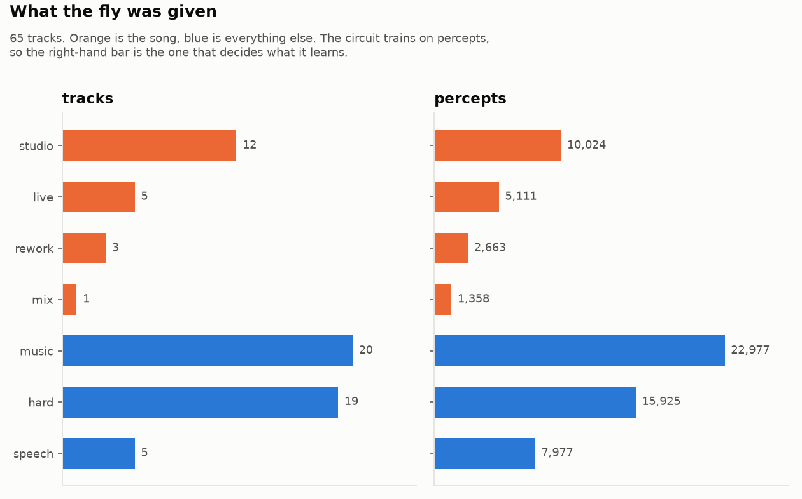
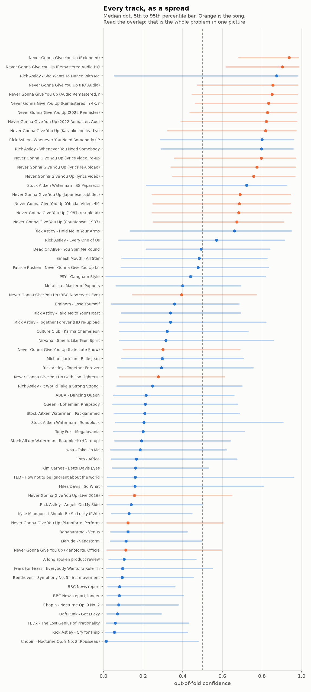
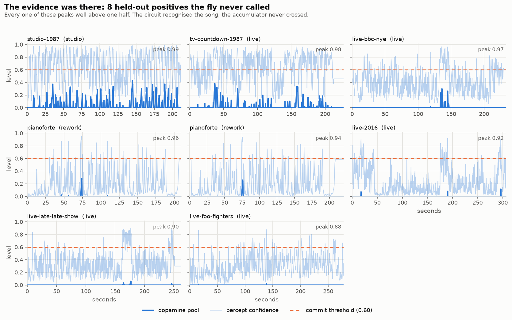
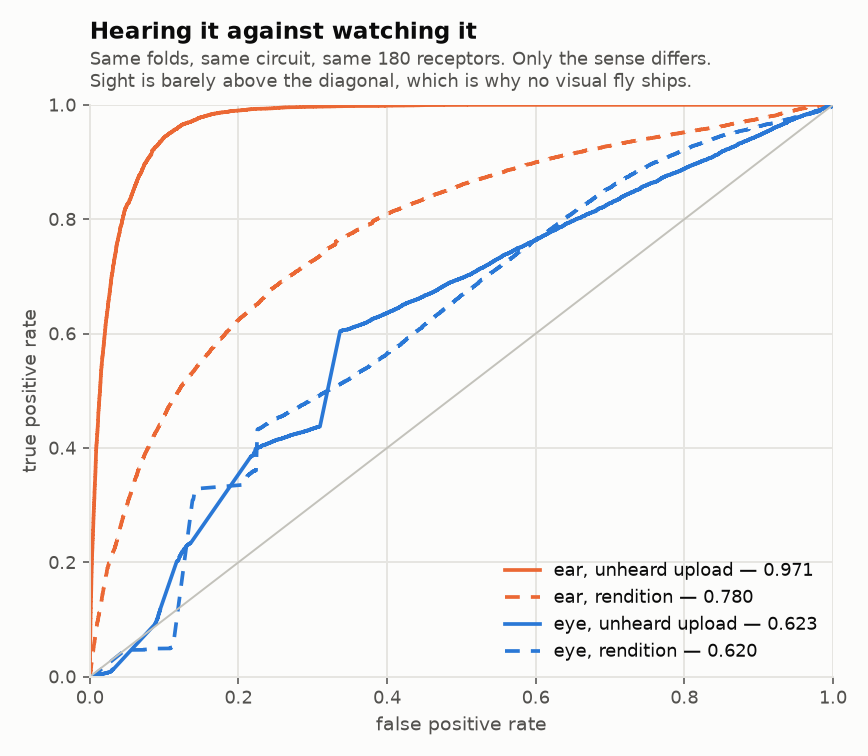

# What the fly was trained on

Generated by `frrf-insights` from the manifest, the cached percepts and the
out-of-fold traces. Nothing here needs the network or a retrain.

`docs/FINDINGS.md` is the argument; this is the data underneath it.

## The corpus

65 tracks, 66,035 percepts, of which 19,156 (29 %) are
the song. That imbalance is handled by weighting rather than by discarding, so
every negative percept in the corpus is seen.

| kind | tracks | percepts | label |
|---|---|---|---|
| music | 20 | 22,977 | not the song |
| hard | 19 | 15,925 | not the song |
| studio | 12 | 10,024 | the song |
| live | 5 | 5,111 | the song |
| speech | 5 | 7,977 | not the song |
| rework | 3 | 2,663 | the song |
| mix | 1 | 1,358 | the song |

Track length runs from 120 s to 480 s, median 227 s. 6 tracks were truncated at the
corpus length cap.

**Folds are by group, not by track.** The 50 groups exist so that two
uploads of the same recording can never be split across a fold boundary; holding
out a track while its twin is still in training measures nothing. The largest
groups are `studio-1987` (12), `pianoforte` (2), `astley-together-forever` (2), `astley-whenever` (2), `saw-roadblock` (2).

## What it does with each one

A track is not one number, and the overlap in the middle of that figure is the
whole problem: the fly is not confidently wrong about the negatives it misses,
it is *unsure*, and it is unsure about several positives too.

Two rows are worth finding by eye. **She Wants To Dance With Me** — same
artist, same producers, same year — sits near the very top, above most of the
actual positives; that single row is the "it learned Stock Aitken Waterman,
1987, that voice" problem the README admits to. And every live performance and
the piano cover sit in the bottom half, which is the rendition number being
0.6 rather than 0.97.

## What cross-validation found

| | percept AUC | track recall | track specificity | median commit |
|---|---|---|---|---|
| unheard rendition | 0.704 macro · 0.780 pooled | 0.619 | 0.909 | 41.9 s |
| unheard upload | 0.971 macro · 0.971 pooled | 1.000 | 0.977 | 10.0 s |

The macro figure hides a wide spread, which is what the per-fold chart is for.

## What the commit rule cost

## What it still misses

## Sound against sight

The same circuit, the same folds, the same 180 receptors — only the sense
differs. Sight sits barely above the diagonal, which is why `frrf-train`
refuses to ship a visual fly and why there is no `models/fly_eye.npz`. The
reasoning is finding 7.
